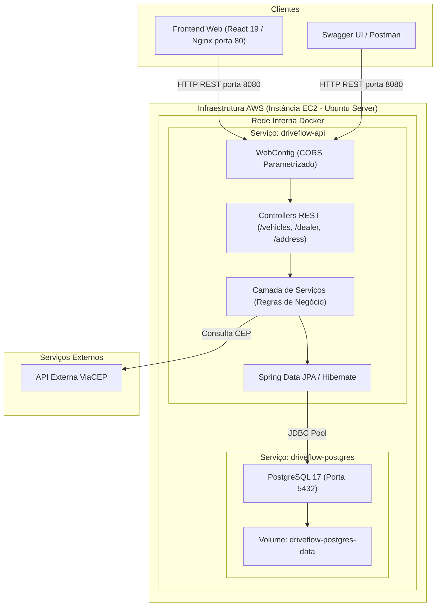

# DriveFlow API

API RESTful para gestão centralizada de veículos e concessionárias, desenvolvida com Java 21 e Spring Boot para atender aos requisitos do Desafio Técnico para Desenvolvedor Fullstack.

---

## 1. Acesso ao Ambiente em Nuvem (Deploy AWS)

A solução encontra-se implantada e operacional em uma instância **AWS EC2 (t3.micro)** na região `us-east-1`, orquestrada via Docker Compose.

* **Documentação Swagger UI / OpenAPI:** [http://3.88.198.138:8080/swagger-ui/index.html](http://3.88.198.138:8080/swagger-ui/index.html)
* **Especificação OpenAPI (JSON):** [http://3.88.198.138:8080/v3/api-docs](http://3.88.198.138:8080/v3/api-docs)
* **Aplicação Web (Frontend):** [http://3.88.198.138](http://3.88.198.138)
* **Repositório do Frontend:** [https://github.com/luanrrsouza/driveflow-web](https://github.com/luanrrsouza/driveflow-web)

---

## 2. Desenho da Arquitetura da Solução



---

## 3. Tecnologias e Bibliotecas Utilizadas

| Categoria | Tecnologia | Versão | Finalidade |
| :--- | :--- | :--- | :--- |
| **Linguagem** | Java | 21 (LTS) | Linguagem orientada a objetos moderna com Virtual Threads |
| **Framework** | Spring Boot | 3.x / 4.x | Framework base para desenvolvimento de microserviços e APIs |
| **Persistência** | Spring Data JPA / Hibernate | - | Mapeamento objeto-relacional (ORM) e abstração de repositórios |
| **Banco de Dados** | PostgreSQL | 17 | Sistema de gerenciamento de banco de dados relacional |
| **Documentação** | SpringDoc OpenAPI | 3.x | Geração automatizada de documentação OpenAPI e Swagger UI |
| **Build Tool** | Apache Maven | Wrapper (mvnw) | Gerenciamento de ciclo de vida e dependências |
| **Containerização** | Docker / Compose | v2 | Empacotamento reproduzível da aplicação e banco de dados |

---

## 4. Estrutura Arquitetural do Backend

A API foi projetada com base em princípios de **Arquitetura em Camadas e Clean Architecture**, desacoplando o domínio de negócios da infraestrutura:

```text
src/main/java/com/dev/driveflowapi/
├── application/             # Casos de uso e orquestração da aplicação
│   ├── dto/                 # Data Transfer Objects para transporte seguro de dados
│   ├── mapper/              # Conversores entre entidades e DTOs
│   ├── port/                # Interfaces de entrada e saída (Ports)
│   └── service/             # Implementação das regras de negócio
├── config/                  # Configurações de infraestrutura (WebConfig, CORS, OpenAPI)
├── domain/                  # Entidades de domínio e contratos de repositório
└── infrastructure/          # Detalhes de implementação técnica
    ├── controller/          # Controladores REST da API
    │   ├── dto/             # DTOs de requisição e resposta específicos dos endpoints
    │   └── exception/       # Manipulador global de exceções (@RestControllerAdvice)
    ├── integration/         # Integrações com serviços externos (Cliente ViaCEP)
    └── persistence/         # Entidades JPA e repositórios Spring Data
```

---

## 5. Endpoints da API REST

### Gestão de Concessionárias (`/dealer`)
* `GET /dealer`: Lista todas as concessionárias registradas.
* `GET /dealer/{id}`: Consulta dados de uma concessionária específica por ID.
* `POST /dealer`: Cadastra uma nova concessionária com validação de CNPJ e CEP.
* `PUT /dealer/{id}`: Atualiza os dados de uma concessionária existente.
* `DELETE /dealer/{id}`: Exclui uma concessionária do catálogo.

### Gestão de Veículos (`/vehicles`)
* `GET /vehicles`: Lista todos os veículos do catálogo.
  * Suporta filtro por concessionária via query parameter: `GET /vehicles?dealerId={id}`.
* `GET /vehicles/{id}`: Consulta detalhes de um veículo por ID.
* `POST /vehicles`: Registra um veículo associado obrigatoriamente a uma concessionária.
* `PUT /vehicles/{id}`: Atualiza as especificações ou altera a concessionária vinculada.
* `DELETE /vehicles/{id}`: Remove o veículo do catálogo.

### Integração ViaCEP (`/address`)
* `GET /address/{zipCode}`: Consulta automatizada de logradouro, bairro, cidade e estado a partir do CEP informado.

---

## 6. Instruções de Execução

### Pré-requisitos
* Git
* Java 21 (JDK) e Maven (para execução local direta)
* Docker e Docker Compose (para execução em containers)

---

### Opção A: Execução Integrada via Docker Compose (Recomendado)

Inicia o Banco de Dados PostgreSQL, a API Spring Boot e a interface Frontend simultaneamente:

1. Clone ambos os repositórios em um mesmo diretório:
   ```bash
   git clone https://github.com/luanrrsouza/driveflow-api.git
   git clone https://github.com/luanrrsouza/driveflow-web.git
   ```

2. Acesse a pasta da API:
   ```bash
   cd driveflow-api
   ```

3. Execute a orquestração:
   ```bash
   docker compose up -d --build
   ```

4. Verifique o status das aplicações:
   * **API REST:** [http://localhost:8080](http://localhost:8080)
   * **Swagger UI:** [http://localhost:8080/swagger-ui/index.html](http://localhost:8080/swagger-ui/index.html)
   * **Frontend Web:** [http://localhost](http://localhost)

---

### Opção B: Execução Local da API via Maven

1. Certifique-se de que uma instância do PostgreSQL está ativa na porta `5432`.
2. Configure as credenciais do seu banco de dados local via variáveis de ambiente ou no arquivo `application.properties`:
   * `DB_URL`: `jdbc:postgresql://localhost:5432/<nome_do_banco>`
   * `DB_USER`: `<seu_usuario>`
   * `DB_PASSWORD`: `<sua_senha>`
   * `CORS_ALLOWED_ORIGINS`: `http://localhost:5173`
3. Execute a aplicação utilizando o Maven Wrapper:
   ```bash
   ./mvnw spring-boot:run
   ```

---

## 7. Variáveis de Ambiente

A aplicação parametriza suas conexões e políticas de acesso através das seguintes variáveis de ambiente:

| Variável | Descrição | Exemplo de Formato |
| :--- | :--- | :--- |
| `DB_URL` | URL de conexão JDBC com o PostgreSQL | `jdbc:postgresql://<host>:<porta>/<database>` |
| `DB_USER` | Usuário de conexão com o banco de dados | Definido pelo operador do ambiente |
| `DB_PASSWORD` | Senha de conexão com o banco de dados | Definido pelo operador do ambiente |
| `CORS_ALLOWED_ORIGINS` | Lista de origens permitidas (separadas por vírgula) | `http://localhost:5173,http://<ip-ou-dominio>` |

### Configuração em Diferentes Ambientes

Para definir essas variáveis em outra máquina ou ambiente:
* **Via Docker Compose:** Os valores podem ser informados na seção `environment` do serviço `driveflow-api` no arquivo `docker-compose.yaml` ou através de um arquivo `.env` na raiz do projeto.
* **Via Terminal / Shell:** Podem ser exportadas no sistema operacional antes da inicialização direta (`export DB_USER=...` e `export DB_PASSWORD=...`).

> **Nota de Segurança Arquitetural:**  
> Por diretrizes de segurança da informação e conformidade com práticas de DevSecOps, credenciais de acesso não devem ser expostas em repositórios públicos ou documentações abertas. Em ambientes produtivos em nuvem (AWS), dados sensíveis como senhas e strings de conexão devem ser armazenados e injetados de forma segura utilizando serviços especializados como **AWS Secrets Manager** ou **AWS Systems Manager Parameter Store**.

---

## 8. Boas Práticas e Qualidade de Software

* **SOLID:** Separação clara de responsabilidades com inversão de dependências via injeção gerenciada pelo Spring.
* **DTOs e Isolamento de Domínio:** Entidades JPA não são expostas na camada web, prevenindo vazamento de dados de infraestrutura.
* **Tratamento Global de Erros:** Exceções de negócio mapeadas centralizadamente com códigos HTTP padronizados (400 Bad Request, 404 Not Found, 500 Internal Server Error).
* **Metodologia Ágil:** Escopo organizado e documentado via GitHub Projects com issues em quadro Kanban.
